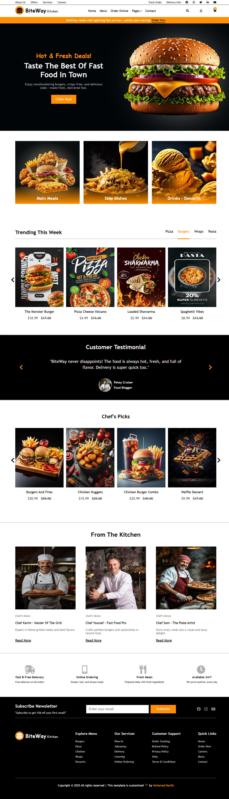

# 🍔 BiteWay Kitchen - Fast Food Restaurant Website

  
*A modern and fully responsive fast-food restaurant website template.*

---

## 📖 About the Project
**BiteWay Kitchen** هو قالب لموقع مطعم وجبات سريعة مصمم ليكون بسيطًا، جذابًا، وسهل التصفح.  
يحتوي على أقسام متعددة لعرض العروض، الوجبات الأكثر طلبًا، ترشيحات الشيف، وقسم خاص بالاشتراك في النشرة البريدية.  

---

## ✨ Features
- تصميم متجاوب باستخدام **HTML5 + CSS3 + Media Queries** 📱💻
- شريط علوي للعروض والروابط السريعة
- قسم عروض ترويجية جذابة (Hero Section)
- تصنيفات واضحة للوجبات (وجبات رئيسية، أطباق جانبية، مشروبات وحلويات)
- عرض الوجبات الأكثر طلبًا خلال الأسبوع
- ترشيحات الشيف لأفضل الأطباق
- قسم "من المطبخ" لعرض الطهاة
- أيقونات **Font Awesome 5**
- نموذج اشتراك في النشرة البريدية

---

## 🛠 Built With
- **HTML5**
- **CSS3**
- **Font Awesome 5**
- **Media Query** (لتصميم متجاوب مع جميع الشاشات)

---

## 📂 Folder Structure
Fast-Food-Kitchen/
│── index.html
│── css/
│ └── style.css
│── images/
│ └── (صور الموقع)افتح الملف index.html في المتصفح.

استمتع بتجربة الموقع.

📸 Live Preview
🔗 [View Demo](https://mohamed-baslib.github.io/fast-food-website/
)

📄 License
هذا المشروع مفتوح المصدر تحت رخصة MIT License.
│── README.md
---

## 📦 Installation & Usage
1. **Clone the repository**:
   ```bash
   git clone https://github.com/USERNAME/Fast-Food-Kitchen.git
